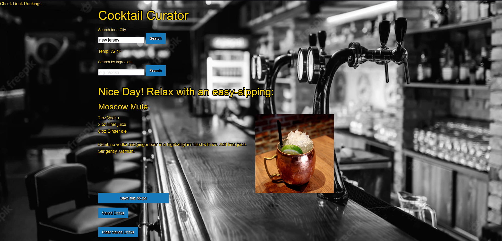
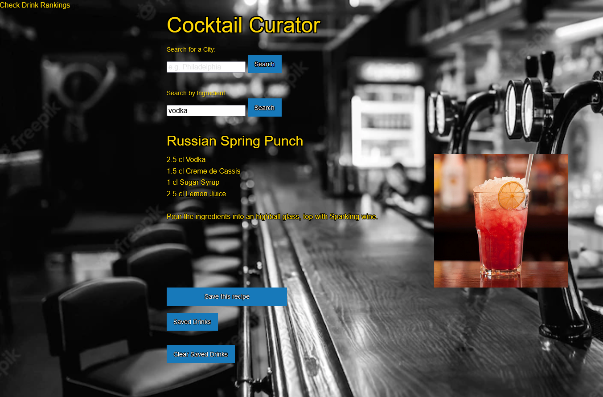
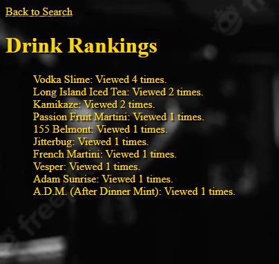

# Cocktail-Curator

Welcome to the Cocktail Curator! We've created a page to offer recommendations based on the temperature of the city you're searching, as well as the option to search by ingredient to see all the possible choices out there! There is also an option to save those drinks locally to a list for you to refer to later for when the opportunity arises.

Here is an example of the screen that you are welcomed with on loading the page. An age verification check is needed for you to enter the site, afterwords you're free to roam around as you please.

First, you can search the city you live in to see a recommendation of a drink best suited for the temperature of where you are.

 

After an ingredient search this is what it will be like once returned. A list of 5 random choices using the specific ingredient you searched.

You can click on any of the results to be greeted with the recipe and instructions on how to make the cocktail. 

 

We also collect the data on how often you view secific recipe to determine your favorite.

##

https://james-stapleton.github.io/Cocktail-Curator/